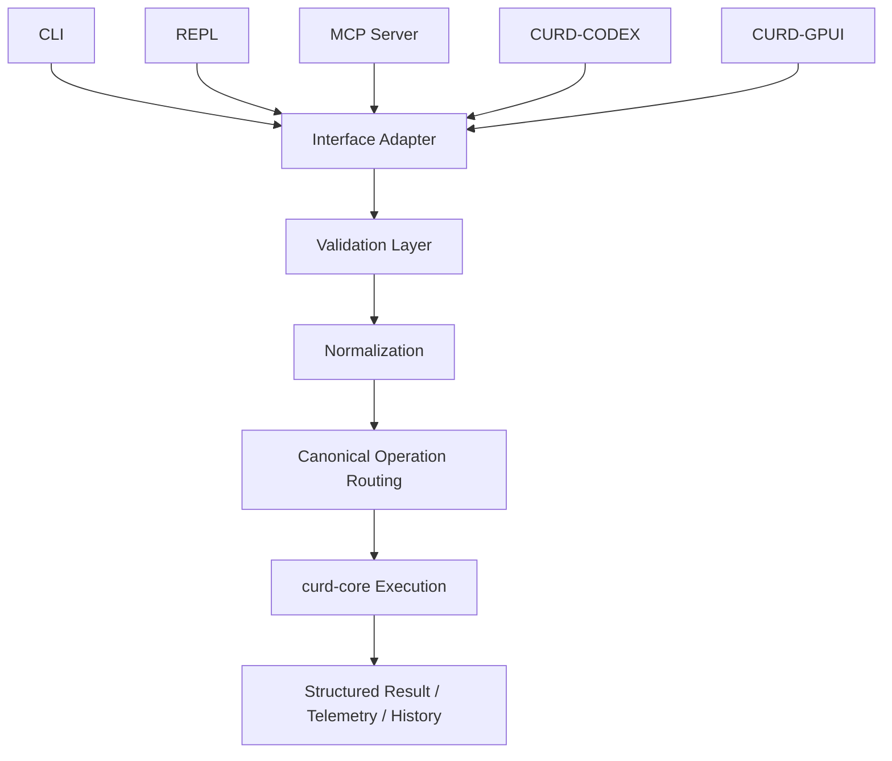

CURD's control plane is the single authority for all operations—whether invoked via CLI, REPL, MCP, or application agents. It enforces runtime ceilings, profiles, sessions, and policies before routing to core business logic.

## Architecture Overview



All interfaces are **adapters over the same control plane**, not independent execution authorities.

---

## Core Rule

<Note>
  **No Bypass Allowed**: All interfaces must route through the control plane. Direct calls to `curd-core` business logic that skip validation, ceiling checks, profile checks, or session enforcement are forbidden.
</Note>

### Prohibited Patterns

- Calling `curd-core` APIs directly to skip validation
- Bypassing runtime ceiling checks
- Bypassing profile/capability checks
- Mutating workspace outside a session
- Inventing separate permission models per interface

### Required Flow

<Steps>
  <Step title="Interface Adapter">
    CLI/REPL/MCP/CODEX/GPUI receives request
  </Step>
  
  <Step title="Validation and Normalization">
    Request is validated against runtime ceiling, profile, and policy
  </Step>
  
  <Step title="Canonical Operation Routing">
    Validated request is routed to the appropriate `curd-core` engine
  </Step>
  
  <Step title="Execution">
    `curd-core` executes the operation
  </Step>
  
  <Step title="Structured Result">
    Result is returned with telemetry and history updates
  </Step>
</Steps>

---

## Validation Layer

All tool calls pass through `validate_tool_call` before execution:

```rust
// From curd/src/validation.rs:16-39
pub fn validate_tool_call(
    ctx: &EngineContext,
    tool: &str,
    args: &Value,
    is_human: bool,
) -> Result<(RuntimeCeiling, CanonicalOperationKind, Option<String>), Value> {
    match validate_tool_call_core(ctx, tool, args, is_human) {
        Ok(validated) => Ok(validated),
        Err(err) => Err(json!({
            "error": {
                "code": err.code,
                "message": err.message,
                "details": if err.details.is_null() {
                    json!({
                        "tool": tool,
                        "capability": capability_for_tool(tool).as_str()
                    })
                } else {
                    err.details
                }
            }
        })),
    }
}
```

### Validation Checks

1. **Runtime Ceiling**: Is the tool allowed under current `CURD_MODE` (lite/full)?
2. **Profile Capability**: Does the active profile grant the required capability atom?
3. **Session Requirement**: Does the tool require an active workspace session?
4. **Policy Gates**: Are there policy restrictions on this operation?

---

## Routing Layer

Validated calls are routed to canonical operations:

```rust
// From curd/src/router.rs:93-123
pub async fn route_validated_tool_call(
    name: &str,
    params: &Value,
    ctx: &EngineContext,
    is_human: bool,
) -> Value {
    match validate_tool_call(ctx, name, params, is_human) {
        Ok(_) => route_tool_call(name, params, ctx).await,
        Err(err) => {
            let message = err
                .get("error")
                .and_then(|v| v.get("message"))
                .and_then(|v| v.as_str())
                .unwrap_or("Validation failed")
                .to_string();
            let details = err
                .get("error")
                .and_then(|v| v.get("details"))
                .cloned()
                .unwrap_or(Value::Null);
            json!({
                "error": message,
                "details": details
            })
        }
    }
}

pub async fn route_tool_call(name: &str, params: &Value, ctx: &EngineContext) -> Value {
    dispatch_tool(name, params, ctx).await
}
```

### Special Routing

- `execute_dsl`, `execute_plan` → DSL/Plan runtime with nested validation
- `batch` → Dependency DAG executor
- `connection_open`, `connection_verify` → Cryptographic session management
- `history` → Telemetry retrieval

---

## Capability Enforcement

Every tool maps to a **capability atom** and **canonical operation**:

```rust
// From curd/src/validation.rs:41-92 (excerpt)
pub fn annotate_tool_entry(entry: &mut Value) {
    let Some(name) = entry.get("name").and_then(|v| v.as_str()) else { return };
    let capability = capability_for_tool(name);
    let op = canonical_op_for_tool(name);
    
    let session_required = matches!(
        capability.as_str(),
        "change.prepare" | "change.apply" | "change.revert" |
        "exec.task" | "exec.command" | "plan.execute" | "plan.parallel"
    );
    
    let approval_requirement = match capability.as_str() {
        "session.commit" => json!("user_or_policy"),
        "change.apply" => json!("profile_or_policy"),
        "exec.command" => json!("policy"),
        _ => Value::Null,
    };
    
    entry["x-curd"] = json!({
        "capability": capability.as_str(),
        "operation": op,
        "session_required": session_required,
        "approval_requirement": approval_requirement
    });
}
```

### Capability Atoms

| Tool | Capability | Session Required | Approval |
|------|-----------|-----------------|----------|
| `search` | `query.search` | No | None |
| `read` | `query.read` | No | None |
| `edit` | `change.prepare` | Yes | Profile/Policy |
| `manage_file` | `change.apply` | Yes | Profile/Policy |
| `shell` | `exec.command` | Yes | Policy |
| `workspace(commit)` | `session.commit` | Yes | User/Policy |
| `execute_plan` | `plan.execute` | Conditional* | Profile |

<Note>
  **Conditional Session**: `execute_plan` and `execute_dsl` require a session **only if** the payload contains mutating operations.
</Note>

---

## Session Enforcement

Mutating operations require an active **shadow workspace session**:

```rust
// From curd/src/router.rs:66-90
fn tool_requires_shadow_session(tool: &str) -> bool {
    matches!(
        tool,
        "edit" | "manage_file" | "mutate" | "proposal" |
        "refactor" | "shell" | "build" |
        "execute_plan" | "execute_active_plan" | "execute_dsl"
    )
}

fn dsl_requires_shadow_session(nodes: &[DslNode]) -> bool {
    compiled_script_requires_shadow_session(nodes)
}

fn plan_requires_shadow_session(plan: &Plan) -> bool {
    plan.nodes.iter().any(|node| match &node.op {
        ToolOperation::McpCall { tool, .. } => tool_requires_shadow_session(tool),
        ToolOperation::Internal { command, .. } => command == "clear_shadow",
    })
}
```

### Session Lifecycle

<Steps>
  <Step title="Begin Session">
    ```json
    {"tool": "workspace", "args": {"action": "begin"}}
    ```
    Creates `.curd/shadow/root/` for transactional edits
  </Step>
  
  <Step title="Perform Mutations">
    `edit`, `manage_file`, `shell`, or plan execution modify shadow workspace
  </Step>
  
  <Step title="Diff and Review">
    ```json
    {"tool": "workspace", "args": {"action": "diff"}}
    ```
    Shows staged changes before commit
  </Step>
  
  <Step title="Commit or Rollback">
    ```json
    {"tool": "workspace", "args": {"action": "commit", "proposal_id": "prop_123"}}
    ```
    Applies changes to workspace or discards shadow state
  </Step>
</Steps>

<Warning>
  Attempting mutating operations without an active session returns error code `-32000` with message: `"Workspace session required for mutating operations"`.
</Warning>

---

## Runtime Ceilings

### Lite Mode

Restrictive toolset for embedded or sandboxed environments:

```rust
// From curd/src/mcp.rs:35-49
pub fn allows_tool(self, tool: &str) -> bool {
    match self {
        McpServerMode::Full => true,
        McpServerMode::Lite => {
            matches!(tool, "search" | "read" | "edit" | "graph" | "workspace")
        }
    }
}
```

**Allowed in Lite Mode:**
- `search`, `read`, `edit`, `graph`, `workspace`
- No shell execution
- No plan/DSL execution
- No debug/profile tools

### Full Mode

All tools available, subject to profile and policy gates.

---

## Profile Configuration

Profiles define capability boundaries in `settings.toml`:

```toml
[profiles.default]
capabilities = [
    "query.search", "query.read", "query.graph",
    "change.prepare", "change.apply",
    "exec.task", "plan.execute"
]
require_session_for_mutation = true
promotion_mode = "manual"

[profiles.ci_strict]
capabilities = ["query.search", "query.read"]
require_session_for_mutation = true
promotion_mode = "deny"
```

<ParamField path="capabilities" type="array" required>
  List of allowed capability atoms (e.g., `"change.apply"`, `"exec.command"`)
</ParamField>

<ParamField path="require_session_for_mutation" type="boolean" default={true}>
  Enforce session requirement for mutating operations
</ParamField>

<ParamField path="promotion_mode" type="string" default="manual">
  Approval flow: `"manual"` (human approval required), `"auto"` (policy-gated), or `"deny"` (all mutations rejected)
</ParamField>

---

## Plans and DSL

Plan and DSL execution are **not privileged bypasses**. They route through the same validation:

```rust
// From curd-core (simplified)
pub async fn route_execute_dsl(params: &Value, ctx: &EngineContext) -> Value {
    let nodes = params.get("nodes").and_then(|v| v.as_array())?;
    let profile = params.get("profile").and_then(|v| v.as_str());
    
    if dsl_requires_shadow_session(nodes) {
        let session_active = check_session_active(ctx, params)?;
        if !session_active {
            return json!({"error": "DSL payload requires active workspace session"});
        }
    }
    
    for node in nodes {
        match node {
            DslNode::Call { tool, args } => {
                let validated = validate_tool_call(ctx, tool, args, false)?;
                // Execute tool...
            }
            // ...
        }
    }
    // ...
}
```

### Hardening Rules

- Plan nodes are bounded in count
- Dependency fan-in is bounded
- Retries are bounded
- Output compaction limits are bounded
- Duplicate node IDs are rejected
- Unsupported internal commands are rejected
- Non-human plan execution cannot use `clear_shadow`
- Mutating plan/DSL payloads require an active workspace session

---

## Error Adaptation

Interfaces should treat CURD errors as **structured control signals**:

### Error Categories

| Code | Category | Meaning |
|------|----------|----------|
| `-32601` | Ceiling Denied | Tool disabled in current runtime mode |
| `-32000` | Profile Denied | Active profile lacks required capability |
| `-32000` | Session Required | Mutating operation attempted without session |
| `-32000` | Policy Denied | Operation blocked by `settings.toml` policy |
| `-32602` | Validation Failed | Invalid parameters or schema violation |

**Example Error:**

```json
{
  "error": {
    "code": -32000,
    "message": "Workspace session required for mutating operations",
    "details": {
      "tool": "edit",
      "capability": "change.prepare",
      "required_session": true
    }
  }
}
```

<Warning>
  Do not flatten errors into generic text. Preserve structured fields so agents/UIs can adapt correctly (e.g., auto-opening a session or prompting for approval).
</Warning>

---

## Integration Pattern for App Agents

<Steps>
  <Step title="Read tools/list">
    Discover capabilities and session requirements
  </Step>
  
  <Step title="Select Profile">
    Choose appropriate profile from `settings.toml` (defaults to `profiles.default`)
  </Step>
  
  <Step title="Open Connection (Optional)">
    For stateful agents: call `connection_open` and `connection_verify` to receive a token
  </Step>
  
  <Step title="Open Workspace Session">
    Before mutations: `workspace(action: "begin")`
  </Step>
  
  <Step title="Execute Routed Operations">
    Use validated tool calls with connection token
  </Step>
  
  <Step title="Persist Structured Outputs">
    Store CURD responses in app state model
  </Step>
  
  <Step title="Render Boundaries Explicitly">
    Show approval, session, and profile boundaries in UI
  </Step>
</Steps>

---

## Prohibited Patterns

<Warning>
  **App agents must NEVER:**
  
  - Call `curd-core` directly to perform business logic
  - Run plan payloads as a way to bypass normal tool restrictions
  - Assume GPUI/CODEX are privileged surfaces
  - Write directly into workspace files outside CURD's session flow
  - Convert structured policy errors into silent retries without changing scope
</Warning>

---

## Repository Structure

### `curd-core`

Owns business logic and core execution:

- `SearchEngine`, `ReadEngine`, `EditEngine`, `GraphEngine`
- `WorkspaceEngine`, `PlanRuntime`, `PlanAgent`
- `ShadowStore` (transaction layer)
- `Sandbox` (execution isolation)
- Policy enforcement

### `curd`

Owns control plane, routing, and transport:

- CLI argument parsing (`clap`)
- Shared tool routing (`router.rs`)
- Validation layer (`validation.rs`)
- MCP server (`mcp.rs`)
- Interactive REPL (`repl.rs`)

<Note>
  Heavy handlers (like `execute_plan`) run on `spawn_blocking` to avoid blocking the Tokio runtime.
</Note>

---

## Practical Summary

CURD-CODEX and CURD-GPUI are **not separate execution authorities**. They are interface adapters over the same control plane.

That control plane is responsible for:

✅ **Validation**: Schema, parameters, and preconditions  
✅ **Normalization**: Consistent request format  
✅ **Profile Gating**: Capability atom checks  
✅ **Runtime Ceiling Enforcement**: Lite/Full mode restrictions  
✅ **Session Enforcement**: Shadow workspace transaction requirements  
✅ **Policy Decisions**: `settings.toml` blocklists and allowlists  
✅ **Routing into `curd-core`**: Canonical operation dispatch

If your app agent follows this contract, it stays aligned with CURD's safety and determinism model instead of drifting into a parallel runtime.