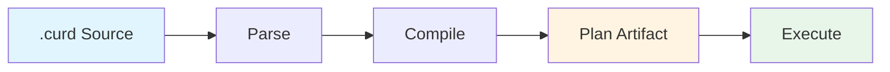

## What are .curd Scripts?

`.curd` is CURD's source scripting language for authoring code intelligence workflows. It provides a human-readable way to express complex code operations that are then compiled into governed execution artifacts.

<Note>
  `.curd` files are source code. The compiled plan artifacts are the execution contracts.
</Note>

## Why Two Formats?

CURD separates authoring from governed execution:

- **`.curd` scripts** are better for humans and agents to author intent
- **Compiled plan artifacts** are better for governed, repeatable execution

### .curd Scripts are Good For

- Readable, reusable workflows
- Easier authoring than raw JSON
- Iterative graph-aware preflight
- Parameterized mutation patterns
- Version control and collaboration

### Plan Artifacts are Good For

- Bound arguments and resolved values
- Explainability metadata
- Explicit safeguards
- Profile and runtime context
- Stable execution history
- Governance-ready execution records

## The Compilation Flow



### Source Script

```curd
# explain: tighten auth validation safely
use session required

arg target_uri: string
let patch = """
pub fn validate(token: &str) -> bool {
    !token.is_empty()
}
"""

atomic {
  edit uri=$target_uri action="upsert" code=$patch
  verify_impact strict=true
}
```

### Compiled Artifact

The script compiles to a JSON artifact in `.curd/plans/` containing:

- Compiled DSL/plan payload
- Source hash (for reproducibility)
- Source path
- Bound argument values
- Explainability metadata
- Safeguards (session requirements, mutation targets)
- Runtime ceiling snapshot

## Language Features

The `.curd` language currently supports:

- **Directives**: `use profile`, `use session`
- **Arguments**: `arg` declarations with types and defaults
- **Variables**: `let` bindings
- **Strings**: Single-line, multiline (`"""`), and interpolation
- **Tool Calls**: Direct tool invocation with named parameters
- **Control Flow**: `sequence`, `atomic`, `abort`
- **Comments**: Regular (`#`) and structured explainability comments

<Warning>
  `parallel` is parsed but rejected at compile/execute time until the runtime has honest parallel lowering.
</Warning>

## When to Use .curd Scripts

Use `.curd` scripts when you want:

- **Repeatability**: Run the same workflow across multiple targets
- **Governance**: Compile to artifacts that can be reviewed before execution
- **Parameterization**: Use arguments to create multiple concrete plans from one source
- **Documentation**: Explainability comments that become part of the execution artifact
- **Safety**: Graph-aware preflight checks before mutation

## Script Lifecycle

### 1. Check

```bash
curd run check fix_auth.curd
```

Does not mutate. Reports:
- Resolved targets
- Graph-adjacent impact
- Conflict risk
- Session requirements
- Suggested safeguards

### 2. Compile

```bash
curd run compile fix_auth.curd
```

Emits a compiled plan artifact under `.curd/plans/`.

### 3. Edit (Optional)

```bash
curd plan edit <plan-id>
```

Refine compiled defaults:
- Choose stricter profile
- Lower output budgets
- Reduce retries
- Add execution constraints

### 4. Execute

```bash
curd workspace begin
curd run fix_auth.curd
curd workspace commit
```

<Tip>
  Always use workspace sessions for mutating scripts. Use `rollback` to discard changes.
</Tip>

## Trust Model

- `.curd` files are normal source files (easy to write)
- Compiled plan artifacts are stronger execution objects (easier to govern)
- Humans and agents author `.curd`
- CURD compiles and enriches the result
- Safeguards can be added after impact is visible

## Next Steps

<CardGroup cols={2}>
  <Card title="Syntax Reference" icon="code" href="/scripting/syntax">
    Learn the .curd language syntax
  </Card>
  <Card title="Variables" icon="brackets-curly" href="/scripting/variables">
    Work with arguments and variables
  </Card>
  <Card title="Control Flow" icon="diagram-project" href="/scripting/control-flow">
    Use sequence, atomic, and abort
  </Card>
  <Card title="Tool Calls" icon="wrench" href="/scripting/tool-calls">
    Call CURD tools from scripts
  </Card>
</CardGroup>
